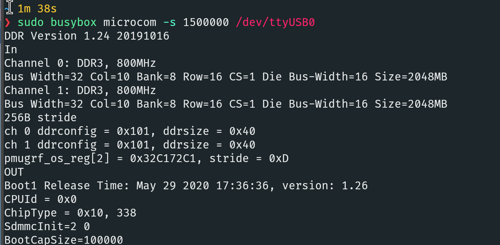
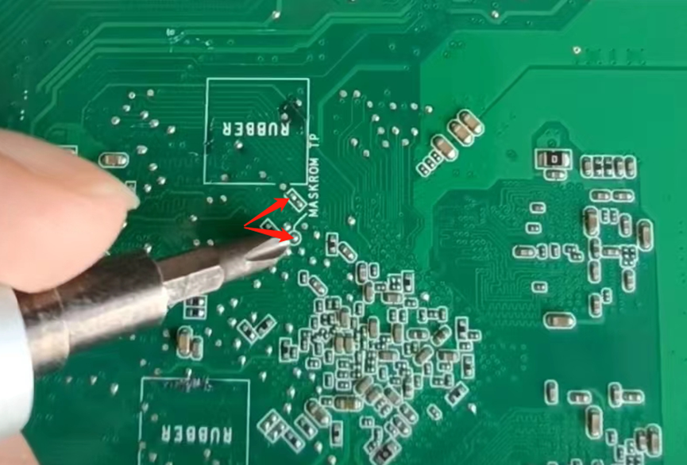
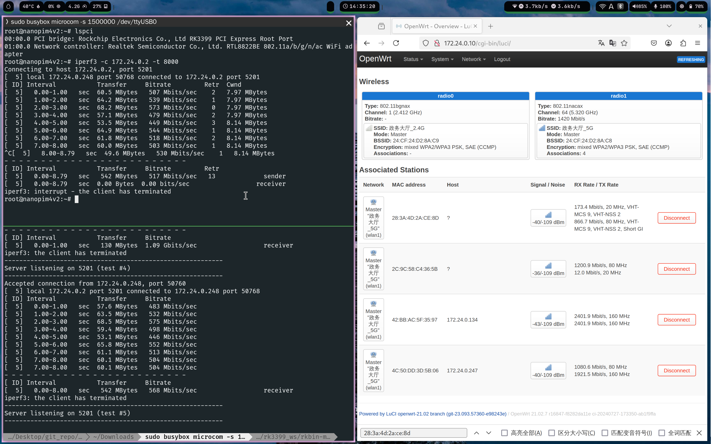
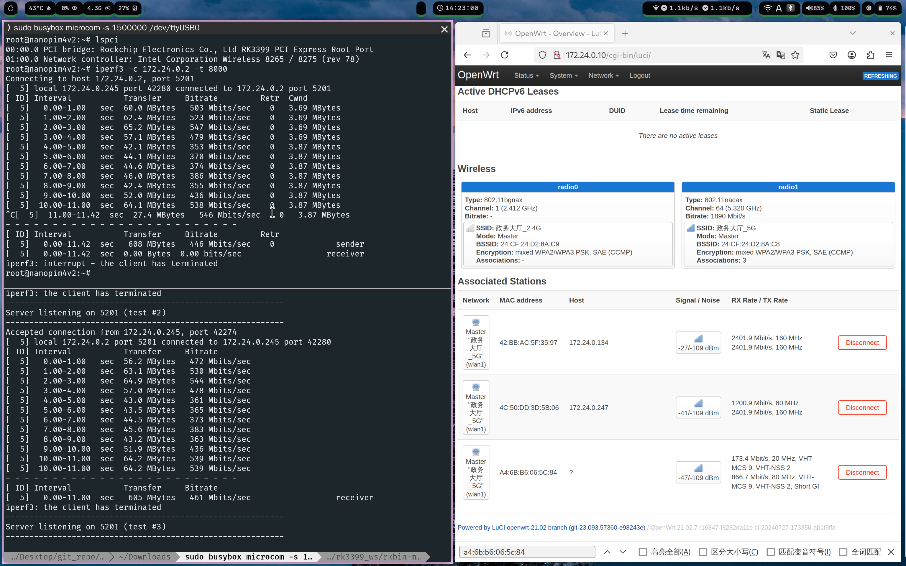
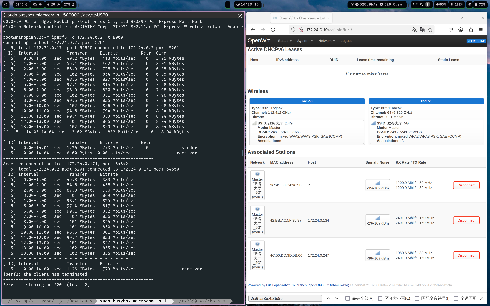
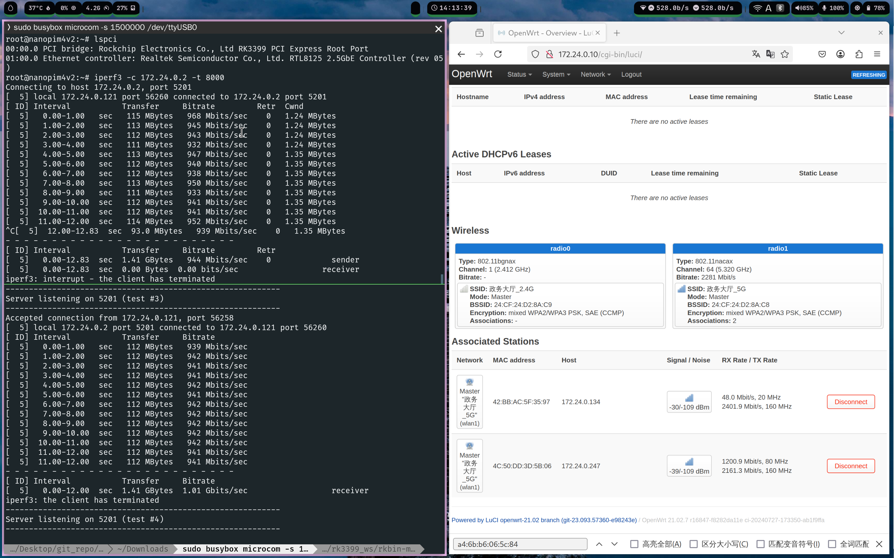

# SoC与存储

SoC为RK3399

RAM为4GB的DDR3，频率是1600MHz，这点可以从原版系统启动日志中看出：

Maskrom模式下使用的loader文件在[这里](https://github.com/retro98boy/tn3399-v3-linux/blob/master/tools/rk3399_loader_v1.30.130.bin)

ROM为32GB的eMMC

# Maskrom短接点

# 主线U-Boot

仓库提供主线U-Boot补丁，参考[此处](https://github.com/retro98boy/tn3399-v3-linux#%E7%BC%96%E8%AF%91%E4%B8%BB%E7%BA%BFu-boot)编译和使用

# 主线设备树

仓库中的主线设备树搭配主线内核可以驱动除尾插HDMI的所有IO

# M.2 Key E接口

由于PCIe总线可以枚举硬件，M.2 Key E接口上插上模块后，只要在主线内核中开启对应的驱动即可，不需要在设备树中描述硬件

已经测试正常工作的模块：

瑞昱RTL8822BE WiFi5（板子自带）

英特尔8265NGW WiFi5

联发科MT7921 WiFi6

瑞昱RTL8125B 2.5G以太网（仅测试了千兆链路）

RK3399支持PCIe 2.1，但是主线内核中设备树默认限制到PCIe gen1的速度

可在`&pcie0`节点中添加`max-link-speed = <2>;`开启PCIe gen2的速度，上述模块除去英特尔8265NGW在开启PCIe gen2速度支持时会卡开机，其余模块两种情况均能工作，测速无明显差别

# 视频输出

前面板的物理视频接口HDMI，其本质是USB Type-C，使用Type-C的DP Alt mode输出DP信号并转换成HDMI信号，走RK3399的VOP Big时可输出4K 60Hz的视频信号

要让RK3399将视频输出到Type-C，一般有专用的芯片来检测Type-C的连接情况。SMART AM40无此类芯片，且使用场景固定为输出DP信号，只需要知道什么时候该输出DP信号即可

[该补丁](https://github.com/armbian/build/blob/main/patch/kernel/archive/rockchip64-6.12/general-add-miniDP-virtual-extcon.patch)可添加一个extcon驱动，通过检测GPIO，来告知RK3399的cdn-dp驱动什么时候输出DP信号，~~但是补丁目前有个Bug，`vpd->det_gpio = devm_gpiod_get_optional(dev, "det", GPIOD_OUT_LOW);`应为`vpd->det_gpio = devm_gpiod_get_optional(dev, "det", GPIOD_IN);`~~，Bug已修复，Armbian官方内核搭配本仓库设备树即可驱动前面板HDMI

如果前面板HDMI无信号输出，手动`modprobe extcon-usbc-virtual-pd`即可，推荐将其添加到initramfs中，对于Armbian，只要在`/etc/initramfs-tools/modules`中添加一行`extcon-usbc-virtual-pd`，然后执行`update-initramfs -u`即可

PS: 主线cdn DP驱动的工作需要名为dptx.bin的固件，应将其放在/lib/firmware/rockchip下。可在[armbian/firmware](https://github.com/armbian/firmware)下载该固件，Armbian系统镜像自带
